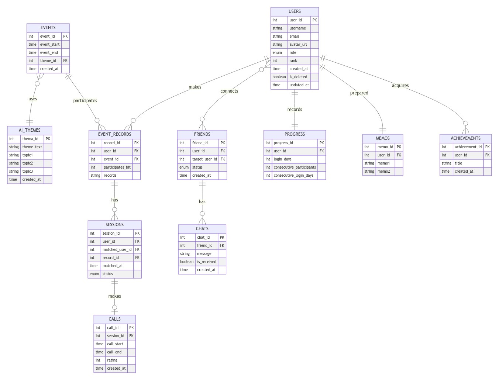

# SpeakUp

## 概要

HackU 2024 @Kanzawavol，チーム「Speak Up」の発表作品です．

## 説明

みなさんの英語学習をサポートする英会話プラットフォーム「Speak Up」．本アプリでは，とにかく初めての一歩を踏み出す工夫がたくさん詰まっています．たとえば，セッション中にわからない単語をAIが教えてくれたり，メモが持ち込めたりと，とにかく工夫がいっぱい！
ぜひ，使ってみてください．

## 技術スタック

  <h2 align="center">使用技術</h2>
  

## 発表資料

## 設計図

### ER図

